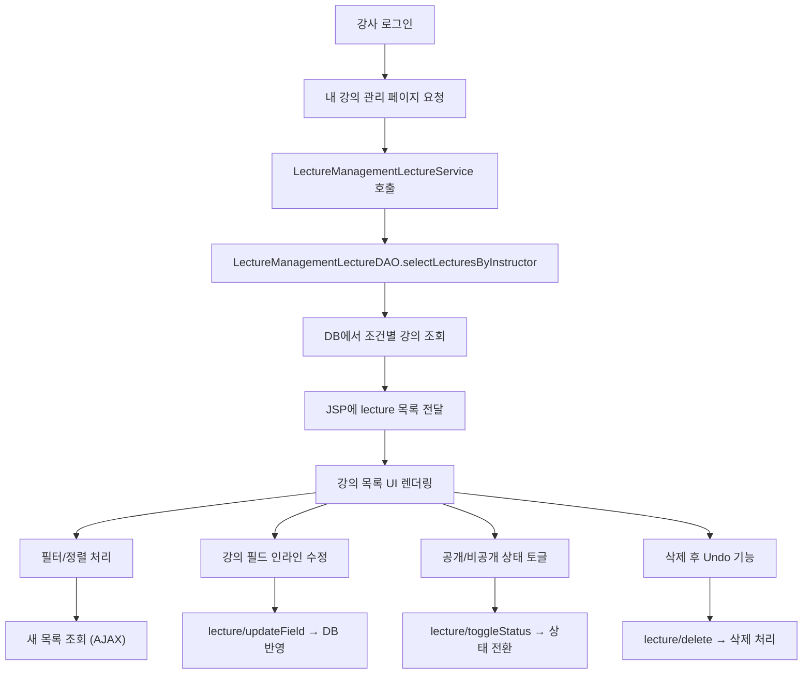

# 📌“강사 전용 강의 관리 기능, 한 화면 안에 담은 유지보수형 UX 아키텍처”

🗓 2025년 4월 30일 | ✍️ by 박찬희

---

## 🧭 개발 배경 – "하나의 화면에서, 모든 강의 액션을"

강사는 콘텐츠 제작자이자 운영자다.

그들에게는 무엇보다도 효율적인 "관리 도구"가 필요하다.

이번 기능의 목표는 명확했다:

> 강사들이 자신의 강의를 한 페이지에서 완전하게 관리할 수 있도록 하자.
> 

단순 조회를 넘어 **필터링, 정렬, 수정, 상태 전환, 삭제, 복구**까지 모두 하나의 화면 안에서 처리할 수 있어야 했다.

---

## 🎯 핵심 설계 목표

| 항목 | 설계 철학 |
| --- | --- |
| 🎯 아키텍처 | JSP 기반 MVC2 + DAO/Service 분리로 유지보수성 확보 |
| 🧱 확장성 | 필드명 기반 수정 구조 → 신규 항목 추가 시 최소 변경 |
| ⚡ UX 반응성 | 전체 페이지 새로고침 없이 AJAX 기반 실시간 동기화 |
| 🧪 테스트 | 컨트롤러 → 서비스 → DAO → DB 흐름 전체 검증 가능 |
| 🧩 UI 통합 | 필터, 상태 전환, 수정, 삭제, 복구까지 하나의 뷰에 배치 |

---

## 📊 전체 흐름 구조 (Mermaid)



---

## 🧩 주요 기능 설계 전략

### 1️⃣ 강의 목록 조회 (검색 + 필터 + 정렬 통합)

- `getLecturesByInstructorFiltered()` 하나의 메서드에 조건 필드 통합
- DAO는 **동적 쿼리**로 필터링 및 정렬 처리
- 검색 키워드는 강의명 + 설명 전체 영역 포함

> ✅ 강사 ID 기반으로만 동작해, 인증 우회 및 과도한 데이터 노출 방지
> 

---

### 2️⃣ 인라인 수정 기능 (UX + 유지보수의 균형)

| 수정 필드 | 검증 규칙 |
| --- | --- |
| 강의명 | 2자 이상 |
| 설명 | 제한 없음 |
| 가격 | 숫자, 0 이상 |
| 카테고리 | Drop-down 선택 제한 |
- `input` 또는 `select`로 전환 후 `blur` 시 AJAX 요청
- 서버에서는 `updateLectureField(lectureId, field, value)` 구조로 처리
    
    → 서비스 단에서 **필드명만 변경해도 재사용 가능**
    

```java
public boolean updateLectureField(Long id, String field, String value)
```

> ⚠ SQL Injection 방지를 위해 field에 대해 whitelist 체크 필수
> 

---

### 3️⃣ 공개/비공개 상태 전환 (토글 UI + 실시간 반영)

- 상태는 Badge 색상과 텍스트로 즉시 변경
- AJAX → `/lecture/toggleStatus` 호출
- 서버에서는 상태 필드만 update 처리

> ✅ 전체 목록 새로고침 없이 UX 흐름 유지
> 

---

### 4️⃣ 강의 삭제 + Undo 기능 (프론트 중심 임시 복구)

- 삭제 시 확인 모달 → 10초간 복구 버튼 노출
- 복구는 현재 UI에서만 가능하지만,
- 추후 Redis TTL 기반 soft-delete 구조로 확장 가능

---

## 🧱 백엔드 구조 (MVC2 + DAO/Service Layer)

| 계층 | 역할 |
| --- | --- |
| Controller | 요청 분기 및 파라미터 수집 |
| Service | 비즈니스 로직 → DAO 호출 분리 |
| DAO | DB 쿼리 실행 (MyBatis 기반) |
| DTO | 데이터 객체 (LectureManagementLectureDTO) |
| JSP | 뷰 렌더링 + AJAX 이벤트 처리 |

---

## 🎨 UI & UX 전략 요약

| 요소 | 설명 |
| --- | --- |
| ✅ 인라인 수정 | 클릭 시 즉시 수정 가능, blur로 저장 |
| ✅ 상태 badge | 공개/비공개 상태 색상 + 텍스트 표시 |
| ✅ 반응형 테이블 | 모바일 대응 (`@media`) |
| ✅ Spinner 표시 | AJAX 요청 중 로딩 시각화 |
| ✅ Toast 메시지 | 결과 메시지 피드백 |
| ✅ 모달 | 삭제 확인 시 UX 분리 및 실수 방지 |

---

## ⚙️ 기술적 하이라이트

### 🔄 동적 필드 수정 구조

```java
// Service
public boolean updateLectureField(Long lectureId, String field, String value)
```

- field는 `title`, `description`, `price`, `category` 등
- SQL에서는 동적 처리가 어려우므로 → DAO 단에서 field명 필터링 후 분기 처리

> ✅ 새로운 필드가 추가돼도 재사용 가능한 구조
> 

---

## 🔐 실무 개선/확장 제안

| 항목 | 개선 포인트 |
| --- | --- |
| 🔒 보안 강화 | CSRF 토큰, 강사 권한 체크, 로그인 세션 검증 |
| 🌐 국제화 | JSTL i18n 도입으로 다국어 지원 |
| 📈 성능 최적화 | Lazy Loading 또는 페이지네이션 |
| 📊 통계 연동 | 수강생 수, 조회 수 컬럼 표시 |
| ♻ Undo 고도화 | 백엔드에 Redis TTL 기반 soft delete 구조 도입 |

---

## ✅ 결과 요약 및 회고

이번 기능은 단순한 CRUD의 나열이 아니라,

**"사용자의 관리 효율성과 개발자의 유지보수성"을 모두 만족시키는 아키텍처**를 목표로 했다.

- 💡 강사 입장에선 클릭 몇 번으로 강의를 완전하게 관리할 수 있고
- 🧱 개발자 입장에선 각 기능이 재사용 가능하고 테스트 가능한 구조로 나뉘어 있음
- ⚙ 실무에서 잦은 유지보수가 필요한 관리자/강사 페이지의 대표 패턴으로 활용 가능

> “강사 관리 페이지는 단순한 테이블이 아니라,
> 
> 
> **비즈니스 요구를 품은 UX 설계 공간이다.**”
> 

> — 기능별로 쪼갠 게 아니라, 사용자 흐름으로 통합한 구조의 힘을 느꼈다.
>
